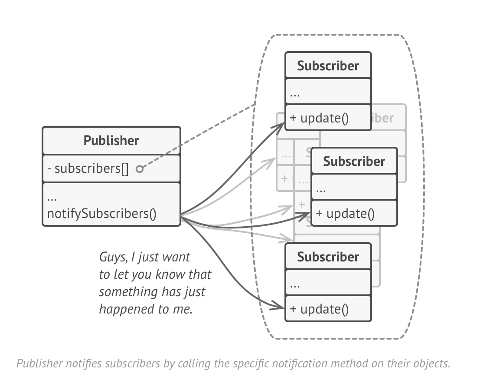

[](https://circleci.com/gh/jackton1/django-model-subscription)
[](https://django-model-subscription.readthedocs.io/en/latest/?badge=latest)
[](https://pypi.org/project/django-model-subscription)
[](https://github.com/jackton1/django-model-subscription/blob/master/LICENSE)
[](https://docs.djangoproject.com/en/2.2/releases/)


https://python-3-patterns-idioms-test.readthedocs.io/en/latest/Observer.html


## Table of contents
* [Installation](#Installation)
* [Motivation](#Motivation)
* [Usage](#Usage)
* [Decorators](#Decorators)
* [Setup Subscribers using App.ready](#Setup-Subscribers-using-App.ready)
* [Setup Subscribers with auto discovery](#Setup-Subscribers-with-auto-discovery)


### Motivation

Extending django models using Observer Pattern.




### Installation

```bash
$ pip install django-model-subscription
```

Add `model_subscription` to your INSTALLED_APPS

```python
INSTALLED_APPS = [
    ...,
    'model_subscription',
    ...
]
```


### Usage

#### Creating subscribers.

- Using `OperationType`

```python
import logging
from model_subscription.decorators import subscribe
from model_subscription.constants import OperationType

log = logging.getLogger(__name__)

@subscribe(OperationType.CREATE, TestModel)
def handle_create(instance):
    log.debug('Created {}'.format(instance.name))


```

- Using `create_subscription` directly (succinct version).

```python

import logging
from model_subscription.decorators import create_subscription

log = logging.getLogger(__name__)

@create_subscription(TestModel)
def handle_create(instance):
    log.debug('Created {}'.format(instance.name))


```


### Decorators

`subscribe`: Explicit (Requires a valid OperationType).


(Create, Update, Delete) operations. 

`create_subscription`: Subscribes to create operation i.e a new instance.

```python
@create_subscription(TestModel)
def handle_create(instance):
    log.debug('1. Created {}'.format(instance.name))
```

`update_subscription`: Subscribes to updates also includes (`changed_data`).
```python
@update_subscription(TestModel)
def handle_update(instance, changed_data):
    log.debug('Updated {} {}'.format(instance.name, changed_data))
```


`delete_subscription`: Subscribes to delete operation: 

> NOTE: The instance.pk is already set to None.

```python
@delete_subscription(TestModel)
def handle_delete(instance):
    log.debug('Deleted {}'.format(instance.name))
```

(Bulk Create, Bulk Update, Bulk Delete) operations. 

`bulk_create_subscription`: Subscribe to bulk create operations.

```python

@bulk_create_subscription(TestModel)
def handle_bulk_create(instances):
    for instance in instances:
        log.debug('Bulk Created {}'.format(instance.name))

```


`bulk_update_subscription`: Subscribe to bulk update operations.

```python
@bulk_update_subscription(TestModel)
def handle_bulk_update(instances):
    for instance in instances:
        log.debug('Updated {}'.format(instance.name))
```


`bulk_delete_subscription`: Subscribe to bulk delete operations.

```python

@bulk_delete_subscription(TestModel)
def handle_bulk_delete(instances):
    for instance in instances:
        log.debug('Deleted {}'.format(instance.name))

```


### Setup Subscribers using App.ready `(Recomended)`. 


Update you `apps.py`


```python

from django.apps import AppConfig


class MyAppConfig(AppConfig):
    name = 'myapp'

    def ready(self):
        from myapp import subscriptions

```


### Setup Subscribers with auto discovery.

By default the `settings.SUBSCRIPTION_AUTO_DISCOVER` is set to `False`.

To use auto discovery this is not recommended as it would notify the subscribers 
wherever the model is used i.e IPython notebook, external scripts.

In your `settings.py` add

```python

SUBSCRIPTION_AUTO_DISCOVER = True

```

#### Setting up the `SUBSCRIPTION_MODULE`

> NOTE: This is only required when ``SUBSCRIPTION_AUTO_DISCOVER = True``

```python

SUBSCRIPTION_MODULE  = 'subscription' 

```
